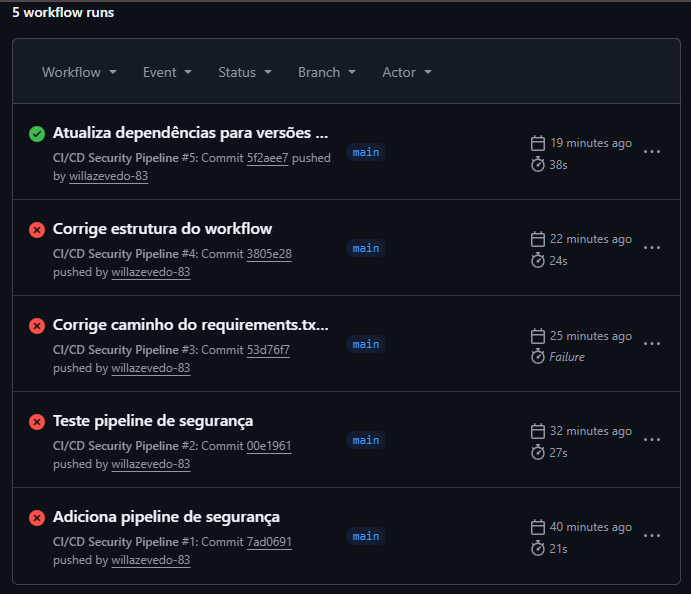
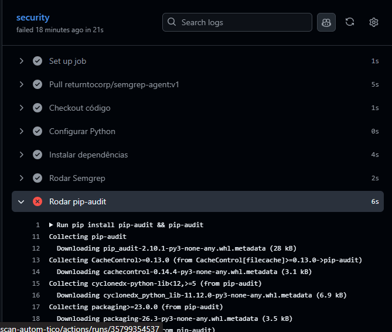
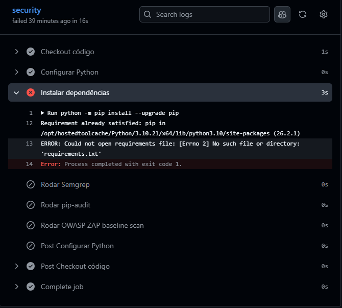
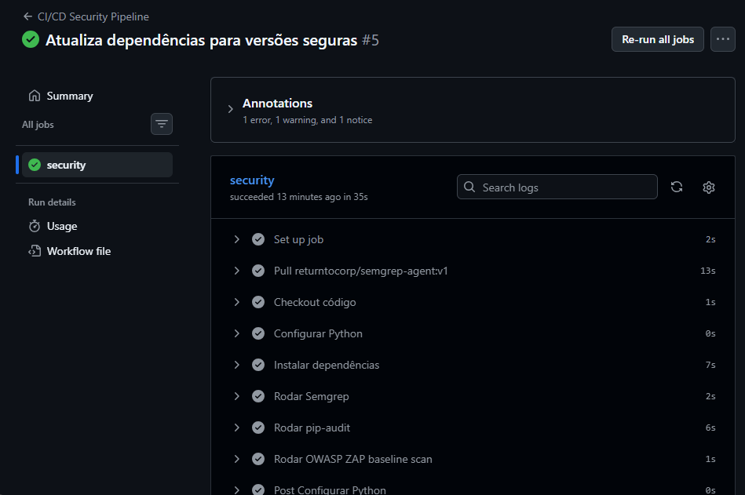

# 🚀 Prática: Scan Automático – Shift-Left Security

Este projeto demonstra a aplicação de segurança **Shift-Left** utilizando GitHub Actions para rodar análises automáticas de código e dependências.

---

## 📌 1. Pipeline

A pipeline é acionada automaticamente a cada **push** ou **pull request** na branch `main`.

**Evidência:**  

---

## 🔒 2. Ferramentas de Segurança

As ferramentas utilizadas foram:

- **SAST** → [Semgrep](https://semgrep.dev/)  
- **SCA** → [pip-audit](https://pypi.org/project/pip-audit/)  
- **DAST** → [OWASP ZAP](https://www.zaproxy.org/)

**Evidência:**  

---

## 📊 3. Resultado da Análise

- **Vulnerabilidades encontradas:**
  - Flask 2.3.2 → vulnerabilidade **PYSEC-2026-2151**  
  - setuptools 79.0.1 → vulnerabilidade **PYSEC-2026-3447**

- **Dependências vulneráveis:** listadas pelo pip-audit  
- **Findings/alertas:** pipeline falhou com **exit code 1**  
- **Classificação de risco:** crítico  
- **Resultado:**  
  - **FAIL** antes da correção (pipeline bloqueou)  
  - **PASS** após atualizar dependências para versões seguras (`Flask 3.1.3`, `setuptools 83.0.0`)

**Evidências:**  
-   
- 

---

## 🔄 4. Fluxo da Solução

Push
↓
Pipeline (GitHub Actions)
↓
SAST (Semgrep)
↓
SCA (pip-audit)
↓
DAST (OWASP ZAP)
↓
Resultado (PASS/FAIL)

---

## ✅ Conclusão

A solução implementa segurança **Shift-Left** de forma prática:  
- O código é analisado automaticamente.  
- Vulnerabilidades são detectadas antes do deploy.  
- O pipeline bloqueia código inseguro e só libera quando corrigido.  

---

